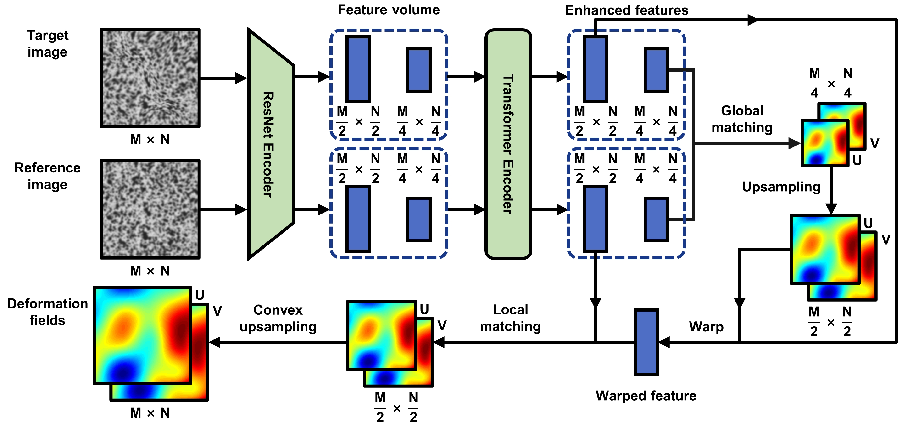

# DICTr: Digital image correlation based on Transformer

**This repository is under construction.**

## Introduction

A DIC network developed based on GMFlow for high accuracy measurement of deformation.



## Prerequisite

System: Ubuntu 22.04.2 LTS

Datasets generation:

- MATLAB ≥ R2020b

DICTr network:

- PyTorch ≥ 1.9.0
- CUDA ≥ 10.2
- Python ≥ 3.8

We recommend creating a Conda environment through the YAML file provided in the repository:

```shell
conda env create -f environment.yml
conda activate dictr
```

## Datasets

The dataset required for DICTr training can be generated through the MATLAB script provided in the repository:

```shell
cd ./DICTrDatasetGenerator
matlab -nodisplay -nosplash
main
```

## Training

Execute the following command in the root directory of the repository:

```shell
sh ./scripts/train.sh
```

For reference, DICTr is trained on a system equipped with an AMD Ryzen 7 5700X@ 3.40GHz CPU, 128 GB RAM, and dual NVIDIA GeForce RTX 3090 Ti GPUs (each with 24GB VRAM). The default batch size is 12 and it took 8 hours. You may need to tune the batch size to fit your hardware.

## Running inference

Execute the following command in the root directory of the repository to run inference:

```shell
sh ./scripts/experiment.sh
```

Two `.csv` files will be generated in the root directory to store the full-field displacement information of $u$ and $v$.

## Pretrained model

The pretrained models of DICTr used in the paper is `./checkpoints/step_080000.pth` provided in the repository.

## Citation

```text

```

## Acknowledgement

This project owes its existence to the indispensable contribution of [GMFlow](https://github.com/haofeixu/gmflow).
