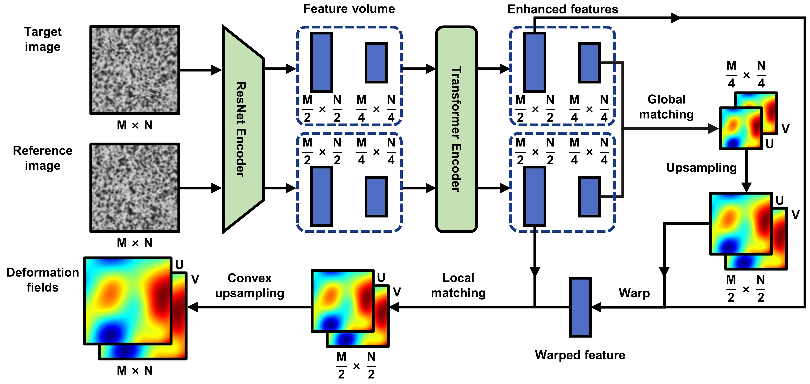

# DICTr: Digital image correlation based on Transformer

Official PyTorch implementation of papers: [**Transformer based deep learning for digital image correlation**](https://doi.org/10.1016/j.optlaseng.2024.108568) and [**Unsupervised Transformer-based deep learning for digital image correlation and digital volume correlation**](https://doi.org/10.1016/j.optlastec.2026.114939)

## Introduction

### DICTr flowchart

A DIC network developed based on GMFlow for high accuracy measurement of deformation.



**Different from previous models that directly establish the relationship between grayscale value changes and the displacements, DICTr reformulates the problem back to the image registration driven by feature matching, which has clearer physical meaning.**


### Unsupervised DICTr

Unsupervised DICTr can build the possible displacement field from the images collected before and after deformation by itself, through the training without ground truth of displacements.

The key issue of unsupervised learning is the design of loss function. In unsupervised DICTr, its loss function fuses the criteria based on **photometric consistency** and **multi-resolution displacement gradient consistency (MrDGC)**, enabling training without labeled displacement data or specific assumptions about the smoothness of displacement.

#### 1. Photometric Consistency Loss ($l_g$)

- $l_{g}=\sum_{j=0}^{2} \frac{w_{j}}{N K_{g}} \sum_{i=0}^{N}\left\| I_{0}\left(x_{i}\right)-I_{1}^{j}\left(x_{i}-u_{j}\left(x_{i}\right)\right)\right\| _{1}$
- Weights ($w_j$): $w_{j}=\frac{0.9^j}{\sum_{k=0}^{2} 0.9^{k}}$ (exponential decay with base 0.9, i.e., intensity differences at higher resolution are assigned  with higher weights); normalized by $N$ (total number of pixels) and $K_g=255$ (max grayscale value for 8-bit image).

#### 2. Multi-resolution Displacement Gradient Consistency Loss ($l_m$)

- $l_{m}=\frac{h\left\| g_{h}-g_{f}\right\| _{1}+q\left\| g_{q}-g_{f}\right\| _{1}}{N K_{m}}$
- Displacement gradients calculated via central difference (forward/backward for edge pixels); weighted as $h=0.9$ (1/2 resolution) and $q=0.1$ (1/4 resolution) to preserve genuine high-frequency deformation.
- Normalized by $N$ (total number of pixels) and $K_m$ (a dimensionless factor determined via 1-epoch trial training).

#### 3. Total Loss Function

- $l_{I}=w_{g} l_{g}+w_{m} l_{m}$
- Optimal weight ratio for DICTr: $w_g : w_m = 4 : 1$.

## Prerequisite

System: Ubuntu 22.04.2 LTS

Datasets generation:

- MATLAB ≥ R2020b

DICTr network:

- Conda ≥ 22.9.0
- PyTorch ≥ 1.13.1
- CUDA ≥ 11.6
- Python ≥ 3.8.11

We recommend creating a [Conda](https://www.anaconda.com/) environment through the YAML file provided in the repository:

```shell
conda env create -f environment.yaml
conda activate dictr
```

When generating datasets and training on remote server, we recommend using [tmux](https://github.com/tmux/tmux/wiki) to prevent accidental session interruptions.

## Datasets

The dataset required for DICTr training can be generated through the MATLAB script provided in the repository:

```shell
cd ./dataset/DICTrDatasetGenerator
matlab -nodisplay -nosplash
>> main_v1 # or
>> main_v2
```

`main_v1.m`: A dataset with a size of 128×128-pixel is generated, where the original images are rendered based on the Boolean model.

`main_v2.m`: A dataset with a size of 256×256-pixel is generated, where the original images are captured by real cameras. The original dataset `RealWorldSpeckle` is avalible at [OpenCorr official website](https://opencorr.org/wp-content/uploads/2026/03/RealWorldSpeckle.7z).

## Training

Execute the following command in the root directory of the repository:

```shell
sh ./scripts/train_v1.sh # or
sh ./scripts/train_v2.sh
```

We employ two sets of parameters in the given model, namely the so-called `v1` and `v2`, detailed explanation of parameters in the train script:

```shell
# training as supervised or unsupervised model
--supervised False
# name of dataset used for training
# you can create your own dataset in the dataset.py file
--stage speckle
# number of image pairs used to update model parameters during each train
# the upper limit depends on your VRAM size
--batch_size 12
# name of dataset used for validation
# you can create your own dataset in the dataset.py and evaluate.py file
--val_dataset speckle
# learning rate
--lr 2e-4
# DICTr use 12 transformer layers (6 blocks) to enhance image features
--num_transformer_layers 12
# DICTr get full resolution result by convex upsampling from 1/2 resolution
--upsample_factor 2
# DICTr use 2 scale features, 1/4 for global match and 1/2 for refinement
--num_scales 2
# number of splits on feature map edge to form window layout for swin transformer
# first parameter is for 1/4 scale feature map
# second parameter is for 1/2 scale feature map
--attn_splits_list 2 8
# radius for feature matching, -1 indicates global matching
# first parameter is for 1/4 scale feature map
# second parameter is for 1/2 scale feature map
--corr_radius_list -1 4
# v1 model use 128 channels for higher-level description of features
# v2 model use 256 channels
--feature_channels 128
# fequency to perform validation
--val_freq 5000
# fequency to save model
--save_ckpt_freq 5000
# total train step for automatic stopping during UNATTENDED TRAINING
--num_steps 100000
```

The table bellow lists teh hyperparameters used in the training using datasets main_v1.m and main_v2.m. Due to differences in VRAM across GPU devices, you may need to adjust both `batch_size` and `num_steps` to complete the training.

| Model       | batch_size | num_transformer_layers | attn_splits_list | feature_channels |
| ----------- | ---------- | ---------------------- | ---------------- | ---------------- |
| train_v1.sh | 12         | 12                     | 2 8              | 2 8              |
| train_v2.sh | 8          | 6                      | 4 16             | 4 16             |

We employ the [Early Stopping](https://en.wikipedia.org/wiki/Early_stopping) regularization approach to determine whether to stop updating the model. Specifically, the supervised network is trained on the training set, and the validation set is periodically evaluated for a decrease in AEE. In order to prevent overfitting, training should halted once the validation performance no longer improves. The final model is then applied to running inference on the test set. **This approach means you do not need to complete all training steps** (`num_steps`).

The training, validation, and test sets should not overlap to prevent data leakage. For further details, please refer to [Wikipedia](https://en.wikipedia.org/wiki/Training,_validation,_and_test_data_sets).

For reference, DICTr is trained on a system equipped with an AMD Ryzen 7 5700X@ 3.40GHz CPU, 128 GB RAM, and dual NVIDIA GeForce RTX 3090 Ti GPUs (each with 24GB VRAM). The default batch size is 12 and it took 8 hours. Unsupervised DICTr is trained on a system equipped with 8 NVIDIA Tesla M40 (each with 24GB VRAM). The default batch size is 8 and it took 13 hours.

## Running inference

Execute the following command in the root directory of the repository to run inference:

```shell
sh ./scripts/experiment_v1.sh # or
sh ./scripts/experiment_v2.sh
```

Detailed explanation of parameters in the experiment script:

```shell
# 128×128 sizes images are recommended using v1
# 256×256 sizes images are recommended using v2
# this parameter should match the resume path
# default: --v1 True
--v1 True
# path to resume model
# you can replace with newly trained result
--resume checkpoints/v1/step_080000.pth
# name of experiment for running inference
# you can create custom test in experiment.py file
--exp_type rotation tension star5 mei realcrack
# DICTr use 12 transformer layers (6 blocks) to enhance image features
--num_transformer_layers 12
# DICTr get full resolution result by convex upsampling from 1/2 resolution
--upsample_factor 2
# DICTr use 2 scale features, 1/4 for global match and 1/2 for refinement
--num_scales 2
# number of splits on feature map edge to form window layout for swin transformer
# first parameter is for 1/4 scale feature map
# second parameter is for 1/2 scale feature map
--attn_splits_list 2 8
# radius for feature matching, -1 indicates global matching
# first parameter is for 1/4 scale feature map
# second parameter is for 1/2 scale feature map
--corr_radius_list -1 4
# v1 model use 128 channels for higher-level description of features
# v2 model use 256 channels
--feature_channels 128
```

The results will be saved in the `./test` folder as plain text files (`.csv`), which store the full-field displacement information of u and v, separately.

A few reference images and the target images can be found in `./test` folder for reproduction of the tests in our papers.

You can add custom test in the `./experiment.py` file.

## Pretrained model

The pretrained models provided in the repository adopts the following hyperparameter settings:

| model                           | paradigm              | exp_type                              | num_transformer_layers | attn_splits_list | feature_channels | Note         |
| ------------------------------- | --------------------- | ------------------------------------- | ---------------------- | ---------------- | ---------------- | ------------ |
| checkpoints/v1/step_080000.pth  | Supervised learning   | rotation tension star5 mei real crack | 12                     | 2 8              | 128              | \            |
| checkpoints/v2/Supervised.pth   | Supervised learning   | rotation mei shear                    | 6                      | 4 16             | 256              | \            |
| checkpoints/v2/Base.pth         | Unsupervised learning | rotation mei shear                    | 6                      | 4 16             | 256              | q=0.1, h=0.9 |
| checkpoints/v2/Smooth.pth       | Unsupervised learning | rotation mei shear                    | 6                      | 4 16             | 256              | q=0.5, h=0.5 |
| checkpoints/v2/WithoutMrDGC.pth | Unsupervised learning | rotation mei shear                    | 6                      | 4 16             | 256              | q=0, h=0     |

## Citation

```bibtex
@article{ZHOU2025108568,
title = {Transformer based deep learning for digital image correlation},
journal = {Optics and Lasers in Engineering},
volume = {184},
pages = {108568},
year = {2025},
issn = {0143-8166},
doi = {https://doi.org/10.1016/j.optlaseng.2024.108568},
url = {https://www.sciencedirect.com/science/article/pii/S0143816624005463},
author = {Yifei Zhou and Qianjiang Zuo and Nan Chen and Licheng Zhou and Bao Yang and Zejia Liu and Yiping Liu and Liqun Tang and Shoubin Dong and Zhenyu Jiang}
}

@article{HE2026114939,
    title = {Unsupervised Transformer-based deep learning for digital image correlation and digital volume correlation},
    journal = {Optics & Laser Technology},
    volume = {198},
    pages = {114939},
    year = {2026},
    issn = {0030-3992},
    doi = {https://doi.org/10.1016/j.optlastec.2026.114939},
    url = {https://www.sciencedirect.com/science/article/pii/S0030399226002902},
    author = {He, Haoyang and Zhou, Yifei and Zhang, Yajing and Cai, Yuqi and Li, Rui and Liu, Yiping and Tang, Liqun and Sun, Taolin and Jiang, Zhenyu}
}
```

## Extension to DVC

An extension of DICTr to digital volume correlation (DVC) can be found [here](https://github.com/vincentjzy/dvctr).

## Acknowledgement

This project owes its existence to the indispensable contribution of [GMFlow](https://github.com/haofeixu/gmflow).
